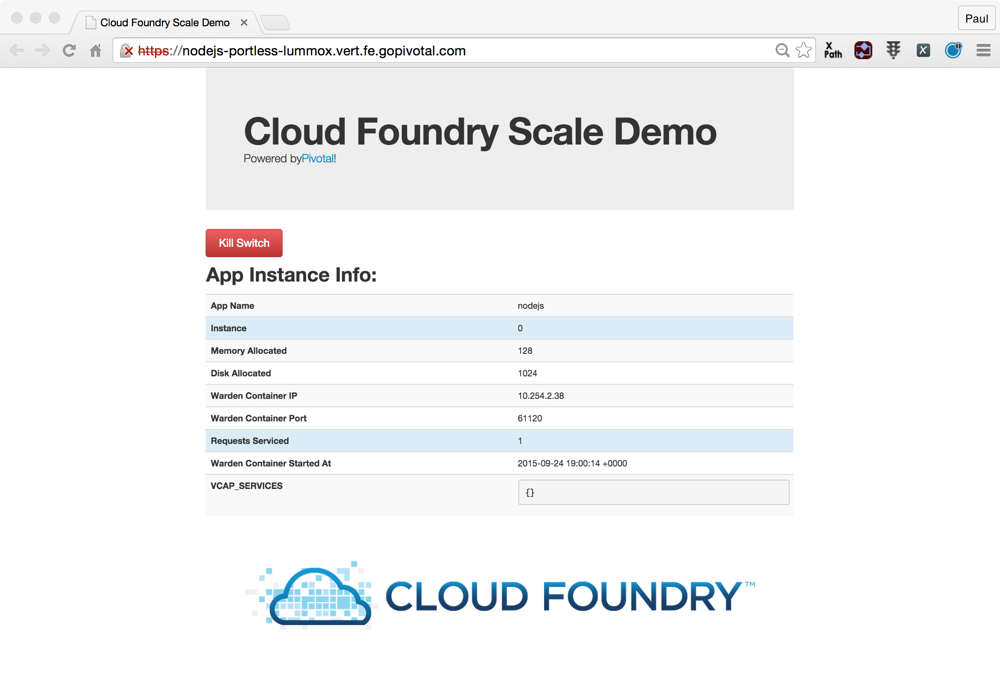

= Lab 1 - From Zero to Pushing Your First Application

== Target

. If you haven't already, download the latest release of the Cloud Foundry CLI from https://github.com/cloudfoundry/cli/releases for your operating system and install it.

. Set the API target for the CLI: (set appropriate end point for your environment)
+
----
$ cf api https://api.devcloudwest.inbcu.com --skip-ssl-validation
----

. Login to Pivotal Cloudfoundry:
+
----
$ cf login
----
+
Follow the prompts

== Push It!

. Change to the _nodejs-cf-sample-ap_ sample application directory:
+
----
$ cd $BOOTCAMP_HOME/nodejs-cf-sample-app
----

. Push the application!
+
----
$ cf push
----
+
You should see output similar to the following listing. Take a look at the listing callouts for a play-by-play of what's happening:
+
====
----
Using manifest file /Users/phopper/workspace/NBCU-PCF-Workshop-101/nodejs-cf-sample-app/manifest.yml <1>

Creating app nodejs in org TELCO / space hopper as phopper@pivotal.io...
OK <2>

Creating route nodejs-portless-lummox.vert.fe.gopivotal.com...
OK <3>

Binding nodejs-portless-lummox.vert.fe.gopivotal.com to nodejs...
OK <4>

Uploading nodejs... <5>
Uploading app files from: /Users/phopper/workspace/NBCU-PCF-Workshop-101/nodejs-cf-sample-app
Uploading 259K, 39 files
Done uploading               
OK

Starting app nodejs in org TELCO / space hopper as phopper@pivotal.io... <6>
-----> Downloaded app package (296K)
-------> Buildpack version 1.2.1
-----> Resetting git environment
-----> Requested node range:  0.10.x
-----> Resolved node version: 0.10.38
-----> Downloading and installing node
-----> Installing dependencies <7>
       npm WARN engine cryptiles@2.0.5: wanted: {"node":">=0.10.40"} (current: {"node":"0.10.38","npm":"1.4.28"})
       npm WARN engine boom@2.9.0: wanted: {"node":">=0.10.40"} (current: {"node":"0.10.38","npm":"1.4.28"})
       npm WARN engine hoek@2.16.3: wanted: {"node":">=0.10.40"} (current: {"node":"0.10.38","npm":"1.4.28"})
       npm WARN engine boom@2.9.0: wanted: {"node":">=0.10.40"} (current: {"node":"0.10.38","npm":"1.4.28"})
       npm WARN engine cryptiles@2.0.5: wanted: {"node":">=0.10.40"} (current: {"node":"0.10.38","npm":"1.4.28"})
       npm WARN engine hoek@2.16.3: wanted: {"node":">=0.10.40"} (current: {"node":"0.10.38","npm":"1.4.28"})
       > cf-sample-app-nodejs@0.0.1 prepublish /tmp/staged/app
       > bower install
       bower open-sans-fontface#~1.0.4       not-cached git://github.com/FontFaceKit/open-sans.git#~1.0.4
       bower open-sans-fontface#~1.0.4          resolve git://github.com/FontFaceKit/open-sans.git#~1.0.4
       bower open-sans-fontface#~1.0.4         download https://github.com/FontFaceKit/open-sans/archive/1.0.4.tar.gz
       bower open-sans-fontface#~1.0.4          extract archive.tar.gz
       bower open-sans-fontface#~1.0.4         resolved git://github.com/FontFaceKit/open-sans.git#1.0.4
       bower open-sans-fontface#~1.0.4          install open-sans-fontface#1.0.4
       open-sans-fontface#1.0.4 bower_components/open-sans-fontface
       express@4.12.4 node_modules/express <8>
       ├── merge-descriptors@1.0.0
       ├── utils-merge@1.0.0
       ├── cookie-signature@1.0.6
       ├── methods@1.1.1
       ├── cookie@0.1.2
       ├── fresh@0.2.4
       ├── escape-html@1.0.1
       ├── range-parser@1.0.2
       ├── vary@1.0.1
       ├── content-type@1.0.1
       ├── finalhandler@0.3.6
       ├── parseurl@1.3.0
       ├── serve-static@1.9.3
       ├── content-disposition@0.5.0
       ├── path-to-regexp@0.1.3
       ├── depd@1.0.1
       ├── qs@2.4.2
       ├── on-finished@2.2.1 (ee-first@1.1.0)
       ├── debug@2.2.0 (ms@0.7.1)
       ├── send@0.12.3 (destroy@1.0.3, ms@0.7.1, mime@1.3.4)
       ├── etag@1.6.0 (crc@3.2.1)
       ├── proxy-addr@1.0.8 (forwarded@0.1.0, ipaddr.js@1.0.1)
       ├── accepts@1.2.13 (negotiator@0.5.3, mime-types@2.1.7)
       └── type-is@1.6.8 (media-typer@0.3.0, mime-types@2.1.7)
       jade@1.11.0 node_modules/jade <9>
       ├── character-parser@1.2.1
       ├── void-elements@2.0.1
       ├── commander@2.6.0
       ├── mkdirp@0.5.1 (minimist@0.0.8)
       ├── jstransformer@0.0.2 (is-promise@2.1.0, promise@6.1.0)
       ├── constantinople@3.0.2 (acorn@2.4.0)
       ├── clean-css@3.4.4 (commander@2.8.1, source-map@0.4.4)
       ├── transformers@2.1.0 (promise@2.0.0, css@1.0.8, uglify-js@2.2.5)
       ├── uglify-js@2.4.24 (uglify-to-browserify@1.0.2, async@0.2.10, yargs@3.5.4, source-map@0.1.34)
       └── with@4.0.3 (acorn@1.2.2, acorn-globals@1.0.6)
       bower@1.5.3 node_modules/bower <10>
       ├── is-root@1.0.0
       ├── junk@1.0.2
       ├── stringify-object@1.0.1
       ├── user-home@1.1.1
       ├── chmodr@0.1.0
       ├── abbrev@1.0.7
       ├── archy@1.0.0
       ├── opn@1.0.2
       ├── bower-logger@0.2.2
       ├── bower-endpoint-parser@0.2.2
       ├── graceful-fs@3.0.8
       ├── lockfile@1.0.1
       ├── nopt@3.0.4
       ├── lru-cache@2.7.0
       ├── retry@0.6.1
       ├── tmp@0.0.24
       ├── md5-hex@1.1.0 (md5-o-matic@0.1.1)
       ├── q@1.4.1
       ├── request-progress@0.3.1 (throttleit@0.0.2)
       ├── shell-quote@1.4.3 (array-filter@0.0.1, array-reduce@0.0.0, array-map@0.0.0, jsonify@0.0.0)
       ├── semver@2.3.2
       ├── which@1.1.2 (is-absolute@0.1.7)
       ├── chalk@1.1.1 (escape-string-regexp@1.0.3, supports-color@2.0.0, ansi-styles@2.1.0, strip-ansi@3.0.0, has-ansi@2.0.0)
       ├── promptly@0.2.0 (read@1.0.7)
       ├── p-throttler@0.1.1 (q@0.9.7)
       ├── mkdirp@0.5.0 (minimist@0.0.8)
       ├── bower-json@0.4.0 (intersect@0.0.3, deep-extend@0.2.11, graceful-fs@2.0.3)
       ├── fstream@1.0.8 (inherits@2.0.1, graceful-fs@4.1.2)
       ├── glob@4.5.3 (inherits@2.0.1, once@1.3.2, inflight@1.0.4, minimatch@2.0.10)
       ├── fstream-ignore@1.0.2 (inherits@2.0.1, minimatch@2.0.10)
       ├── tar-fs@1.8.1 (pump@1.0.0, tar-stream@1.2.1)
       ├── rimraf@2.4.3 (glob@5.0.14)
       ├── decompress-zip@0.1.0 (mkpath@0.1.0, touch@0.0.3, readable-stream@1.1.13, binary@0.3.0)
       ├── update-notifier@0.3.2 (is-npm@1.0.0, string-length@1.0.1, semver-diff@2.0.0, latest-version@1.0.1)
       ├── github@0.2.4 (mime@1.3.4)
       ├── bower-registry-client@0.3.0 (request-replay@0.2.0, rimraf@2.2.8, graceful-fs@2.0.3, lru-cache@2.3.1, async@0.2.10, mkdirp@0.3.5, request@2.51.0)
       ├── cardinal@0.4.4 (ansicolors@0.2.1, redeyed@0.4.4)
       ├── request@2.53.0 (caseless@0.9.0, aws-sign2@0.5.0, forever-agent@0.5.2, stringstream@0.0.4, oauth-sign@0.6.0, tunnel-agent@0.4.1, isstream@0.1.2, json-stringify-safe@5.0.1, node-uuid@1.4.3, qs@2.3.3, combined-stream@0.0.7, form-data@0.2.0, mime-types@2.0.14, bl@0.9.4, http-signature@0.10.1, hawk@2.3.1, tough-cookie@2.0.0)
       ├── mout@0.11.0
       ├── bower-config@0.6.1 (osenv@0.0.3, graceful-fs@2.0.3, optimist@0.6.1, mout@0.9.1)
       ├── insight@0.7.0 (object-assign@4.0.1, async@1.4.2, lodash.debounce@3.1.1, configstore@1.2.1, os-name@1.0.3, tough-cookie@2.0.0, inquirer@0.10.0)
       ├── handlebars@2.0.0 (optimist@0.3.7, uglify-js@2.3.6)
       ├── configstore@0.3.2 (object-assign@2.1.1, xdg-basedir@1.0.1, uuid@2.0.1, osenv@0.1.3, js-yaml@3.4.2)
       └── inquirer@0.8.0 (ansi-regex@1.1.1, figures@1.4.0, mute-stream@0.0.4, through@2.3.8, readline2@0.1.1, chalk@0.5.1, lodash@2.4.2, cli-color@0.3.3, rx@2.5.3)
       less-middleware@2.0.1 node_modules/less-middleware
       ├── node.extend@1.1.5 (is@3.1.0)
       ├── mkdirp@0.5.1 (minimist@0.0.8)
       └── less@2.4.0 (graceful-fs@3.0.8, mime@1.3.4, image-size@0.3.5, promise@6.1.0, errno@0.1.4, source-map@0.2.0, request@2.63.0)
-----> Caching node_modules directory for future builds
-----> Cleaning up node-gyp and npm artifacts
-----> No Procfile found; Adding npm start to new Procfile
-----> Building runtime environment

-----> Uploading droplet (17M) <11>

1 of 1 instances running

App started

OK

App nodejs was started using this command `npm start` <12>

Showing health and status for app nodejs in org TELCO / space hopper as phopper@pivotal.io... <13>
OK

requested state: started
instances: 1/1
usage: 128M x 1 instances
urls: nodejs-portless-lummox.vert.fe.gopivotal.com
last uploaded: Thu Sep 24 18:59:26 UTC 2015
stack: cflinuxfs2
buildpack: Node.js

     state     since                    cpu    memory          disk          details   
#0   running   2015-09-24 01:00:18 PM   0.0%   73.9M of 128M   91.2M of 1G      
----
<1> The CLI is using a manifest to provide necessary configuration details such as application name, memory to be allocated, and path to the application artifact.
Take a look at `manifest.yml` to see how.
<2> In most cases, the CLI indicates each Cloud Foundry API call as it happens.
In this case, the CLI has created an application record for _Workshop_ in your assigned space.
<3> All HTTP/HTTPS requests to applications will flow through Cloud Foundry's front-end router called http://docs.cloudfoundry.org/concepts/architecture/router.html[(Go)Router].
Here the CLI is creating a route with random word tokens inserted (again, see `manifest.yml` for a hint!) to prevent route collisions across the default `devcloudwest.inbcu.com` domain.
<4> Now the CLI is _binding_ the created route to the application.
Routes can actually be bound to multiple applications to support techniques such as http://www.mattstine.com/2013/07/10/blue-green-deployments-on-cloudfoundry[blue-green deployments].
<5> The CLI finally uploads the application bits to Pivotal Cloud Foundry. Notice that it's uploading _39 files_! This is because Cloud Foundry actually explodes a ZIP artifact before uploading it for caching purposes.
<6> Now we begin the staging process. 
<7> Node and NPM dependenices are pulled from git hub, normally they would be pulled from Cloud Foundry, this is specific to Node.
<8> Here we see the version of the 'express@4.12.4 node_modules/express' that has been chosen and installed.
<9> Here we see the version of the 'njade@1.11.0 node_modules/jade' that has been chosen and installed.
<10> Here we see the version of the 'bower@1.5.3 node_modules/bower' that has been chosen and installed.
<11> The complete package of your application and all of its necessary runtime components is called a _droplet_.
Here the droplet is being uploaded to Pivotal Cloudfoundry's internal blobstore so that it can be easily copied to one or more _http://docs.cloudfoundry.org/concepts/architecture/execution-agent.html[Droplet Execution Agents (DEA's)]_ for execution.
<12> The CLI tells you exactly what command and argument set was used to start your application.
<13> Finally the CLI reports the current status of your application's health.
====

. Visit the application in your browser by hitting the route that was generated by the CLI:
+

== Interact with App from CF CLI

. Get information about the currently deployed application using CLI apps command:
+
----
$ cf apps
----
+
Note the application name for next steps

. Get information about running instances, memory, CPU, and other statistics using CLI instances command
+
----
$ cf app <<app_name>>
----

. Stop the deployed application using the CLI
+
----
$ cf stop <<app_name>>
----

. Delete the deployed application using the CLI
+
----
$ cf delete <<app_name>>
----
