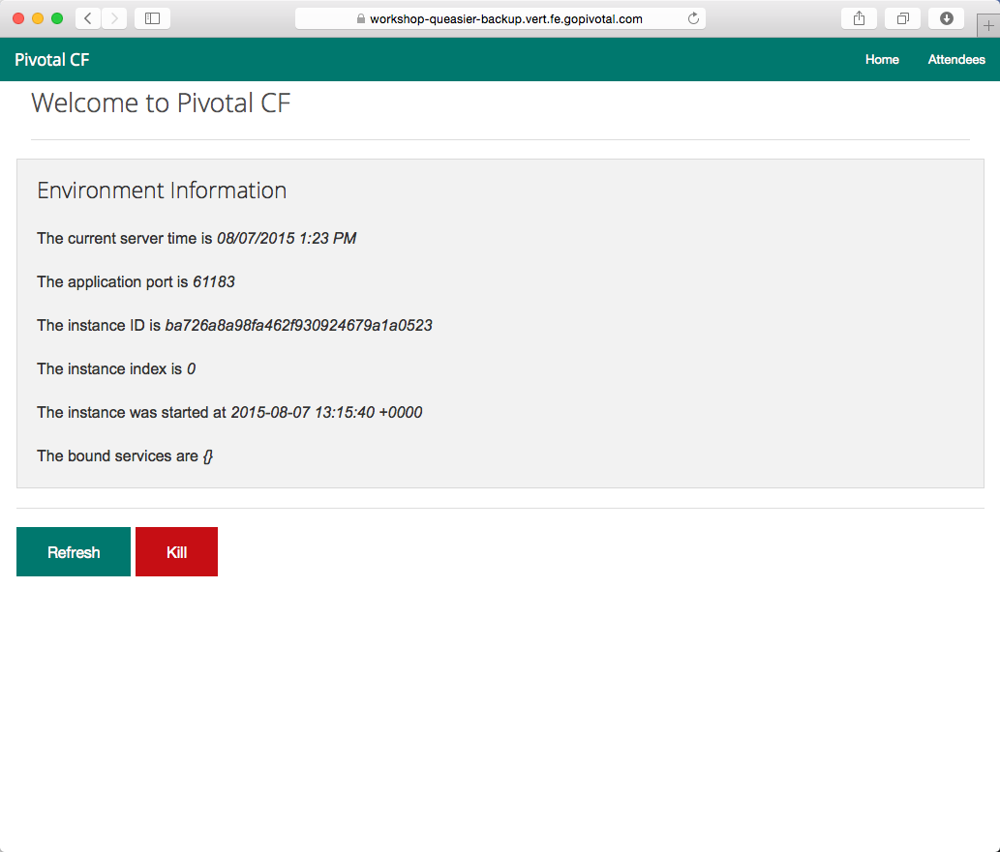

= Lab 1 - From Zero to Pushing Your First Application

== Target

. If you haven't already, download the latest release of the Cloud Foundry CLI from https://github.com/cloudfoundry/cli/releases for your operating system and install it.

. Set the API target for the CLI: (set appropriate end point for your environment)
+
----
$ cf api https://api.pcfsony.com --skip-ssl-validation
----

. Login to Pivotal Cloudfoundry:
+
----
$ cf login
----
+
Follow the prompts

== Push It!

. Change to the _cf-spring-mvc_ sample application directory:
+
----
$ cd $BOOTCAMP_HOME/cf-spring-mvc
----

. Push the application!
+
----
$ cf push
----
+
You should see output similar to the following listing. Take a look at the listing callouts for a play-by-play of what's happening:
+
====
----
Using manifest file /Users/jtgammon/development/customers/sony/PCF-Bootcamp/dev-workshop/cf-workshop-spring-mvc/manifest.yml <1>

Creating app workshop in org TELCO / space gammon as jtgammon@pivotal.io...
OK <2>

Creating route workshop-queasier-backup.vert.fe.gopivotal.com...
OK <3>

Binding workshop-queasier-backup.vert.fe.gopivotal.com to workshop...
OK <4>

Uploading workshop... <5>
Uploading app files from: /Users/jtgammon/development/customers/sony/PCF-Bootcamp/dev-workshop/cf-workshop-spring-mvc/target/cf-workshop-spring-mvc-0.1.war
Uploading 496.9K, 75 files
Done uploading
OK

Starting app workshop in org TELCO / space gammon as jtgammon@pivotal.io... <6>
-----> Downloaded app package (16M)
-----> Java Buildpack Version: v3.0 (offline) | https://github.com/cloudfoundry/java-buildpack.git#3bd15e1
-----> Downloading Open Jdk JRE 1.8.0_40 from https://download.run.pivotal.io/openjdk/trusty/x86_64/openjdk-1.8.0_40.tar.gz (found in cache)
       Expanding Open Jdk JRE to .java-buildpack/open_jdk_jre (1.4s) <7>
-----> Downloading Spring Auto Reconfiguration 1.7.0_RELEASE from https://download.run.pivotal.io/auto-reconfiguration/auto-reconfiguration-1.7.0_RELEASE.jar (found in cache)
       Modifying /WEB-INF/web.xml for Auto Reconfiguration
-----> Downloading Tomcat Instance 8.0.21 from https://download.run.pivotal.io/tomcat/tomcat-8.0.21.tar.gz (found in cache)
       Expanding Tomcat to .java-buildpack/tomcat (0.1s) <8>
-----> Downloading Tomcat Lifecycle Support 2.4.0_RELEASE from https://download.run.pivotal.io/tomcat-lifecycle-support/tomcat-lifecycle-support-2.4.0_RELEASE.jar (found in cache)
-----> Downloading Tomcat Logging Support 2.4.0_RELEASE from https://download.run.pivotal.io/tomcat-logging-support/tomcat-logging-support-2.4.0_RELEASE.jar (found in cache)
-----> Downloading Tomcat Access Logging Support 2.4.0_RELEASE from https://download.run.pivotal.io/tomcat-access-logging-support/tomcat-access-logging-support-2.4.0_RELEASE.jar (found in cache)

-----> Uploading droplet (67M) <9>

1 of 1 instances running

App started

OK

App workshop was started using this command `JAVA_HOME=$PWD/.java-buildpack/open_jdk_jre JAVA_OPTS="-Djava.io.tmpdir=$TMPDIR -XX:OnOutOfMemoryError=$PWD/.java-buildpack/open_jdk_jre/bin/killjava.sh -Xmx382293K -Xms382293K -XX:MaxMetaspaceSize=64M -XX:MetaspaceSize=64M -Xss995K -Daccess.logging.enabled=false -Dhttp.port=$PORT" $PWD/.java-buildpack/tomcat/bin/catalina.sh run` <10>

Showing health and status for app workshop in org TELCO / space gammon as jtgammon@pivotal.io... <11>
OK

requested state: started
instances: 1/1
usage: 512M x 1 instances
urls: workshop.vert.fe.gopivotal.com
last uploaded: Fri Aug 7 13:12:04 UTC 2015
stack: cflinuxfs2
buildpack: java-buildpack=v3.0-offline-https://github.com/cloudfoundry/java-buildpack.git#3bd15e1 open-jdk-jre=1.8.0_40 spring-auto-reconfiguration=1.7.0_RELEASE tomcat-access-logging-support=2.4.0_RELEASE tomcat-instance=8.0.21 tomcat-lifecycle-support=2.4.0_REL...

     state     since                    cpu    memory           disk           details
#0   running   2015-08-07 09:12:37 AM   0.0%   399.2M of 512M   144.4M of 1G
----
<1> The CLI is using a manifest to provide necessary configuration details such as application name, memory to be allocated, and path to the application artifact.
Take a look at `manifest.yml` to see how.
<2> In most cases, the CLI indicates each Cloud Foundry API call as it happens.
In this case, the CLI has created an application record for _Workshop_ in your assigned space.
<3> All HTTP/HTTPS requests to applications will flow through Cloud Foundry's front-end router called http://docs.cloudfoundry.org/concepts/architecture/router.html[(Go)Router].
Here the CLI is creating a route with random word tokens inserted (again, see `manifest.yml` for a hint!) to prevent route collisions across the default `pcf.pcfsony.com` domain.
<4> Now the CLI is _binding_ the created route to the application.
Routes can actually be bound to multiple applications to support techniques such as http://www.mattstine.com/2013/07/10/blue-green-deployments-on-cloudfoundry[blue-green deployments].
<5> The CLI finally uploads the application bits to Pivotal Cloudfoundry. Notice that it's uploading _75 files_! This is because Cloud Foundry actually explodes a ZIP artifact before uploading it for caching purposes.
<6> Now we begin the staging process. The https://github.com/cloudfoundry/java-buildpack[Java Buildpack] is responsible for assembling the runtime components necessary to run the application.
<7> Here we see the version of the JRE that has been chosen and installed.
<8> And here we see the version of Tomcat that has been chosen and installed.
<9> The complete package of your application and all of its necessary runtime components is called a _droplet_.
Here the droplet is being uploaded to Pivotal Cloudfoundry's internal blobstore so that it can be easily copied to one or more _http://docs.cloudfoundry.org/concepts/architecture/execution-agent.html[Droplet Execution Agents (DEA's)]_ for execution.
<10> The CLI tells you exactly what command and argument set was used to start your application.
<11> Finally the CLI reports the current status of your application's health.
====

. Visit the application in your browser by hitting the route that was generated by the CLI:
+

== Interact with App from CF CLI

. Get information about the currently deployed application using CLI apps command:
+
----
$ cf apps
----
+
Note the application name for next steps

. Get information about running instances, memory, CPU, and other statistics using CLI instances command
+
----
$ cf app <<app_name>>
----

. Stop the deployed application using the CLI
+
----
$ cf stop <<app_name>>
----

. Delete the deployed application using the CLI
+
----
$ cf delete <<app_name>>
----
