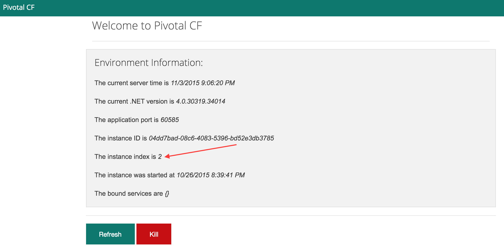
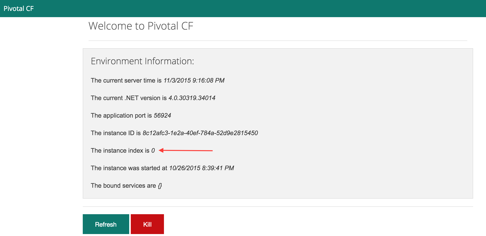
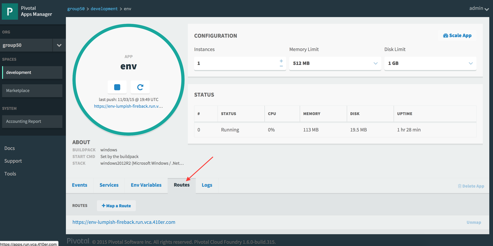
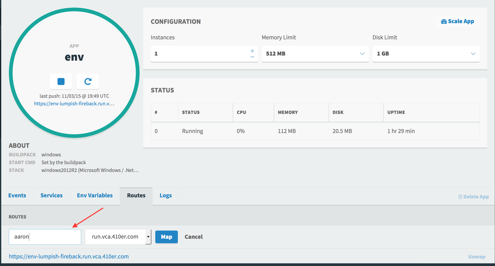
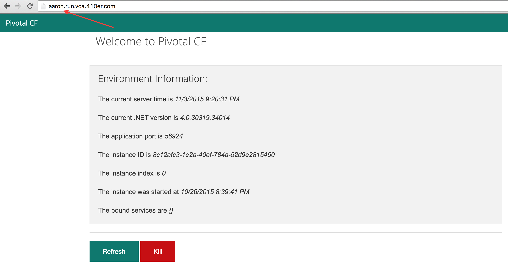
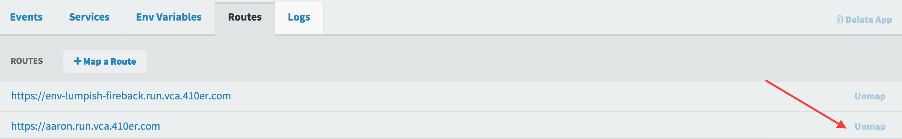
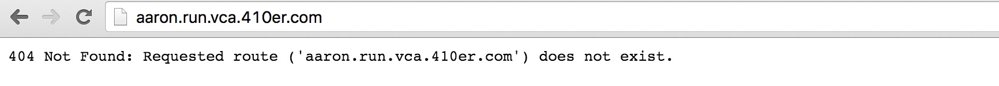

= Lab 3 - Operating your Application

[abstract]
--
Pivotal Cloudfoundry makes the work of performing operations actions, such as scaling, doing a zero-downtime deploy, and managing application health very easy.
In the next two labs we'll explore Pivotal Cloudfoundry operations.
--

== Scale the Application Up

. Now let's increase the number of running application instances to 3.  For this lab you can use the Java, Ruby, or Node.js sample app.  In each of the commands below replace _workshop_ with the name of your deployed application:
+
----
$ cf scale -i 3 workshop
Scaling app workshop in org TELCO / space gammon as jtgammon@pivotal.io...
OK
----
+
In reporting `OK`, the CLI is letting you know that the additional requested instances have been started, but they are not yet necessarily running.

. We can determine how many instances are actually running like this:
+
====
----
$ cf app workshop
Showing health and status for app workshop in org TELCO / space gammon as jtgammon@pivotal.io...
OK

requested state: started
instances: 1/3
usage: 512M x 3 instances
urls: workshop.vert.fe.gopivotal.com, workshop-queasier-backup.vert.fe.gopivotal.com
last uploaded: Fri Aug 7 13:15:14 UTC 2015
stack: cflinuxfs2
buildpack: java-buildpack=v3.0-offline-https://github.com/cloudfoundry/java-buildpack.git#3bd15e1 open-jdk-jre=1.8.0_40 spring-auto-reconfiguration=1.7.0_RELEASE tomcat-access-logging-support=2.4.0_RELEASE tomcat-instance=8.0.21 tomcat-lifecycle-support=2.4.0_REL...

     state      since                    cpu    memory           disk           details
#0   running    2015-08-07 11:33:21 AM   0.1%   477.9M of 512M   144.4M of 1G  <1>
#1   starting   2015-08-07 12:42:56 PM   0.0%   0 of 0           0 of 0  <2>
#2   starting   2015-08-07 12:42:56 PM   0.0%   0 of 0           0 of 0
----
<1> This application instance has completed the startup process and is actually able to accept requests.
<2> This application instance is still starting and will not have any requests routed to it.
====

. Eventually all instances will converge to a running state:
+
----
$ cf app workshop
Showing health and status for app workshop in org TELCO / space gammon as jtgammon@pivotal.io...
OK

requested state: started
instances: 3/3
usage: 512M x 3 instances
urls: workshop.vert.fe.gopivotal.com, workshop-queasier-backup.vert.fe.gopivotal.com
last uploaded: Fri Aug 7 13:15:14 UTC 2015
stack: cflinuxfs2
buildpack: java-buildpack=v3.0-offline-https://github.com/cloudfoundry/java-buildpack.git#3bd15e1 open-jdk-jre=1.8.0_40 spring-auto-reconfiguration=1.7.0_RELEASE tomcat-access-logging-support=2.4.0_RELEASE tomcat-instance=8.0.21 tomcat-lifecycle-support=2.4.0_REL...

     state     since                    cpu    memory           disk           details
#0   running   2015-08-07 11:33:21 AM   0.1%   477.9M of 512M   144.4M of 1G
#1   running   2015-08-07 12:43:04 PM   0.2%   396.2M of 512M   144.4M of 1G
#2   running   2015-08-07 12:43:04 PM   0.2%   394.8M of 512M   144.4M of 1G
----

. Revisit the application route in the browser.
Refresh several times.
You should observe the instance index changing as you do so:
+

+
The aforementioned http://docs.cloudfoundry.org/concepts/architecture/router.html[(Go)Router] is applying a random routing algorithm to all of the application instances assigned to this route.
As an instance reaches the `running` state, its http://docs.cloudfoundry.org/concepts/architecture/execution-agent.html[DEA] registers that instance in the routing table assigned to its route by sending a message to Cloud Foundry's message bus.
All (Go)Router instances are subscribed to this channel and register the routes independently.
This makes for very dynamic and rapid reconfiguration!

== Scale the Application Down

. We can scale the application instances back down as easily as we scaled them up, using the same command structure:
+
----
$ cf scale -i 1 workshop
Scaling app workshop in org TELCO / space gammon as jtgammon@pivotal.io...
OK
----

. Check the application status again:
+
----
$ cf app workshop
Showing health and status for app workshop in org TELCO / space gammon as jtgammon@pivotal.io...
OK

requested state: started
instances: 1/1
usage: 512M x 1 instances
urls: workshop.vert.fe.gopivotal.com, workshop-queasier-backup.vert.fe.gopivotal.com
last uploaded: Fri Aug 7 13:15:14 UTC 2015
stack: cflinuxfs2
buildpack: java-buildpack=v3.0-offline-https://github.com/cloudfoundry/java-buildpack.git#3bd15e1 open-jdk-jre=1.8.0_40 spring-auto-reconfiguration=1.7.0_RELEASE tomcat-access-logging-support=2.4.0_RELEASE tomcat-instance=8.0.21 tomcat-lifecycle-support=2.4.0_REL...

     state     since                    cpu    memory           disk           details
#0   running   2015-08-07 11:33:21 AM   0.1%   477.9M of 512M   144.4M of 1G
----
+
As you can see, we're back down to only one instance running, and it is in fact the original index 0 that we started with.

. Confirm that by again revisiting the route in the browser and checking the instance index:
+

== HTTP Routing

There are two ways to discover what routes, or HTTP URLs, are ampped to an application
The first is available via the CLI. Just type:

----
$ cf app workshop
Showing health and status for app workshop in org TELCO / space zwickey as azwickey@pivotal.io...
OK

requested state: started
instances: 3/3
usage: 512M x 3 instances
urls: workshop-leishmanial-preobligation.vert.fe.gopivotal.com
last uploaded: Fri Sep 25 15:07:25 UTC 2015
stack: cflinuxfs2
buildpack: java-buildpack=v3.1.1-offline-https://github.com/cloudfoundry/java-buildpack#7a538fb java-main java-opts open-jdk-like-jre=1.8.0_51 open-jdk-like-memory-calculator=1.1.1_RELEASE spring-auto-reconfiguration=1.7.0_RELEASE

     state     since                    cpu    memory           disk           details
#0   running   2015-09-25 11:11:33 AM   0.1%   411.6M of 512M   151.6M of 1G
----

and you'll see the list of routes in the section that says _urls_.

The second way is via the Apps Manager UI.  Click on the _Workshop_ application to view application details.  Select the _Routes_ tab to view a list of mapped routes:

. We can easily add an additional route by clicking on _+ Map a Route_ and supplying the new hostname:
+

. Navigate to the new URL in your browser window.  You should see that same application displayed!
+

. We can just as easily remove a route by clicking on _Unmap_ on the route you wish to remove.
+

+
If you navigate to that URL you'll receive a HTTP 404 response
+

. This is how blue-green deployments are accomplished.
+
image::blue-green.png[]

