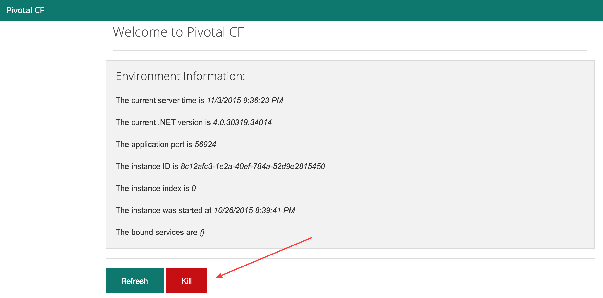
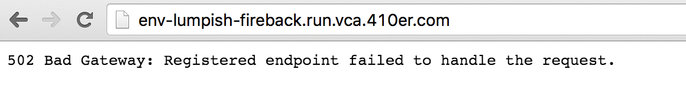
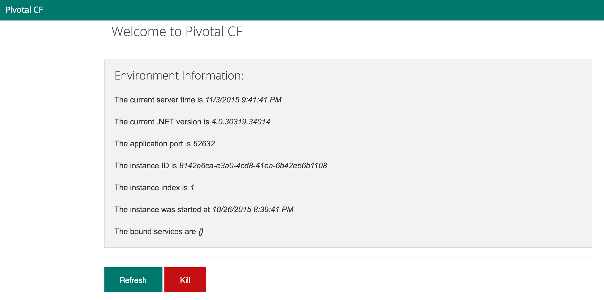

= Lab 4 - Monitoring your Application

[abstract]
--
Pivotal Cloud Foundry makes the work of performing operations actions, such as scaling, doing a zero-downtime deploy, and managing application health very easy.
In the this labs we'll continue to explore Pivotal Cloud Foundry application operations.
--

== Tailing Application Logs

One of the most important enablers of visibility into application behavior is logging.
Effective management of logs has historically been difficult or required wiring into third party tools.
Cloud Foundry's https://github.com/cloudfoundry/loggregator[log aggregation] components simplify log management by assuming responsibility for it.
Application developers need only log all messages to either 'Console.Write' in .NET or  `STDOUT` or `STDERR` in other languages, and the platform will capture these messages.

=== For Developers

Application developers can view application logs using the CF CLI.

. Let's view recent log messages for the application.  For this lab you can use the .NET, Java, Ruby, or Node.js sample app.  In each of the commands below replace _env_ with the name of your deployed application:
+
----
$ cf logs env --recent
----
+
Here are two interesting subsets of one output from that command:
+
.CF Component Logs
====
----
Aarons-MacBook-Pro:lab3 aaron$ cf logs env --recent
Connected, dumping recent logs for app env in org group50 / space development as user50@humana.com...
2015-11-03T16:14:55.86-0500 [HEALTH/0]   OUT healthcheck passed
2015-11-03T16:14:55.87-0500 [HEALTH/0]   OUT Exit status 0
2015-11-03T16:15:26.95-0500 [HEALTH/0]   OUT healthcheck passed
2015-11-03T16:15:26.95-0500 [HEALTH/0]   OUT Exit status 0
2015-11-03T16:15:48.69-0500 [RTR/0]      OUT env-lumpish-fireback.run.vca.410er.com - [03/11/2015:21:15:48 +0000] "GET / HTTP/1.1" 200 0 4052 "http://env-lumpish-fireback.run.vca.410er.com/" "Mozilla/5.0 (Macintosh; Intel Mac OS X 10_11_1) AppleWebKit/537.36 (KHTML, like Gecko) Chrome/46.0.2490.80 Safari/537.36" 192.168.109.250:48826 x_forwarded_for:"205.145.107.107" x_forwarded_proto:"http" vcap_request_id:8cf321a3-8927-4f1f-6a29-fbb430d10b09 response_time:0.004960883 app_id:d8a24476-7db7-4d4f-ba82-bf558098d937
2015-11-03T16:31:35.51-0500 [API/0]      OUT Updated app with guid d8a24476-7db7-4d4f-ba82-bf558098d937 ({"instances"=>2})
2015-11-03T16:31:55.38-0500 [CELL/1]     OUT Creating container
2015-11-03T16:31:56.11-0500 [CELL/1]     OUT Successfully created container
2015-11-03T16:31:56.85-0500 [APP/1]      OUT Running C:\containerizer\7666833450F970B16A\user\app\..\tmp\lifecycle\WebAppServer.exe
2015-11-03T16:31:57.16-0500 [APP/1]      OUT PORT == 62046
2015-11-03T16:31:57.16-0500 [APP/1]      OUT 2015-11-03 21:31:57Z|INFO|Port:62046
2015-11-03T16:31:57.16-0500 [APP/1]      OUT 2015-11-03 21:31:57Z|INFO|Webroot:C:\containerizer\7666833450F970B16A\user\app
2015-11-03T16:31:57.20-0500 [APP/1]      OUT 2015-11-03 21:31:57Z|INFO|Starting web server instance...
2015-11-03T16:31:57.24-0500 [APP/1]      OUT Server Started.... press CTRL + C to stop
2015-11-03T16:31:59.08-0500 [HEALTH/1]   OUT waiting for process to start up
2015-11-03T16:31:59.08-0500 [HEALTH/1]   OUT healthcheck failed
2015-11-03T16:31:59.09-0500 [HEALTH/1]   OUT Exit status 1
2015-11-03T16:32:01.07-0500 [HEALTH/1]   OUT waiting for process to start up
2015-11-03T16:32:01.07-0500 [HEALTH/1]   OUT healthcheck failed
2015-11-03T16:32:01.07-0500 [HEALTH/1]   OUT Exit status 1
2015-11-03T16:32:02.63-0500 [HEALTH/1]   OUT healthcheck failed
2015-11-03T16:32:02.63-0500 [HEALTH/1]   OUT waiting for process to start up
2015-11-03T16:32:02.63-0500 [HEALTH/1]   OUT Exit status 1
2015-11-03T16:32:03.21-0500 [HEALTH/1]   OUT healthcheck passed
2015-11-03T16:32:03.21-0500 [HEALTH/1]   OUT Exit status 0
2015-11-03T16:32:03.41-0500 [HEALTH/0]   OUT healthcheck passed
----
<1> An ``Apache-style'' access log event from the (Go)Router
<2> An API log event that corresponds to an event as shown in `cf events`
<3> A CELL log event indicating the start of an application instance on that CELL.
====
+
.Application Logs
====
----
2015-11-03T16:34:23.13-0500 [APP/1]      OUT Kaboom.
2015-11-03T16:34:23.16-0500 [APP/1]      OUT Exit status -1
----
====
+
As you can see, Cloud Foundry's log aggregation components capture both application logs and CF component logs relevant to your application.
These events are properly interleaved based on time, giving you an accurate picture of events as they transpired across the system.  In this case we output Kaboom when the kill button is pressed in the .NET app

. To get a running ``tail'' of the application logs rather than a dump, simply type:
+
----
$ cf logs env
----
+
You can try various things like refreshing the browser and triggering stop/start events to see logs being generated.

== Health Management

Cloud Foundry's http://docs.cloudfoundry.org/concepts/architecture/#hm9k[Heatlh Manager] actively monitors the health of our application processes and will restart them should they crash.

. If you don't have one already running, start a log tail for `workshop`.  Alternatively, you could view the logs using the papertrail app.
+
----
$ cf logs env
----

. If you do not have more than one application instance running, execute the scale command to scale to 2 or more application instances.  Visit the application in the browser, and click on the ``Kill Switch'' button. This button will trigger a JVM exit with an error code (`System.exit(1)`), causing the Health Manager to observe an application instance crash:
+

. After clicking the kill switch a couple of interesting things should happen.
First, you'll see an error code returned in the browser, as the request you submitted never returns a response:
+

+
Also, if you're paying attention to the log tail, you'll see some interesting log messages fly by:
+
====
----
2015-11-03T16:37:08.81-0500 [API/0]      OUT App instance exited with guid d8a24476-7db7-4d4f-ba82-bf558098d937 payload: {"instance"=>"cf4981df-840f-4bb2-7b23-b53b5c311518", "index"=>1, "reason"=>"CRASHED", "exit_description"=>"2 error(s) occurred:\n\n* 2 error(s) occurred:\n\n* Exited with status -1\n* cancelled\n* cancelled", "crash_count"=>2, "crash_timestamp"=>1446586628807539149, "version"=>"c93939ab-dc75-4093-92cc-21da667d2223"}
2015-11-03T16:37:28.48-0500 [APP/1]      OUT Kaboom.
2015-11-03T16:37:28.51-0500 [APP/1]      OUT Exit status -1
2015-11-03T16:37:28.59-0500 [CELL/1]     OUT Exit status -26
----
<1> Just before issuing the `Environment.Exit(-1)` call, the application logs that the kill switch was clicked.
<2> The (Go)Router logs the 502 error.
<3> The API logs that an application instance exited due to a crash.
====

. Wait a few seconds...  By this time you should have noticed some additional interesting events in the logs:
+
====
----
2015-11-03T16:37:28.68-0500 [CELL/1]     OUT Creating container
2015-11-03T16:37:30.14-0500 [CELL/1]     OUT Successfully created container
2015-11-03T16:37:33.52-0500 [APP/1]      OUT Running C:\containerizer\FE88D0DD0C86689529\user\app\..\tmp\lifecycle\WebAppServer.exe
2015-11-03T16:37:33.54-0500 [APP/1]      OUT PORT == 62632
2015-11-03T16:37:33.54-0500 [APP/1]      OUT 2015-11-03 21:37:33Z|INFO|Port:62632
2015-11-03T16:37:33.54-0500 [APP/1]      OUT 2015-11-03 21:37:33Z|INFO|Webroot:C:\containerizer\FE88D0DD0C86689529\user\app
2015-11-03T16:37:33.57-0500 [APP/1]      OUT 2015-11-03 21:37:33Z|INFO|Starting web server instance...
2015-11-03T16:37:33.61-0500 [APP/1]      OUT Server Started.... press CTRL + C to stop
2015-11-03T16:37:37.47-0500 [HEALTH/1]   OUT healthcheck failed
2015-11-03T16:37:37.47-0500 [HEALTH/1]   OUT waiting for process to start up
2015-11-03T16:37:37.47-0500 [HEALTH/1]   OUT Exit status 1
2015-11-03T16:37:38.65-0500 [HEALTH/1]   OUT healthcheck passed
2015-11-03T16:37:38.65-0500 [HEALTH/1]   OUT Exit status 0 <2>
----
<1> The CELL indicates that it is starting another instance of the application as a result of the Health Manager observing a difference between the desired and actual state (i.e. running instances = 1 vs. running instances = 0).
<2> The new application instance starts logging events as it starts up.
====

. Revisiting the *HOME PAGE* of the application and you should see a fresh instance started:
+

== Viewing Application _Events_

Cloud Foundry only allows application configuration to be modified via its API.
This gives application operators confidence that all changes to application configuration are known and auditable.
It also reduces the number of causes that must be considered when problems arise.

All application configuration changes are recorded as _events_.
These events can be viewed via the Cloud Foundry API, and viewing is facilitated via the CLI.

Take a look at the events that have transpired so far for our deployment of `workshop`:

====
----
cf events env
Getting events for app env in org group50 / space development as user50@humana.com...

time                          event                   actor               description
2015-11-03T16:37:08.00-0500   app.crash               env                 index: 1, reason: CRASHED, exit_description: 2 error(s) occurred:

* 2 error(s) occurred:

* Exited with status -1
* cancelled
* cancelled
2015-11-03T16:31:35.00-0500   audit.app.update        user50@humana.com   instances: 2
2015-11-03T15:06:29.00-0500   audit.app.update        user50@humana.com   instances: 1
2015-11-03T14:52:19.00-0500   audit.app.update        user50@humana.com   instances: 2
2015-11-03T14:49:19.00-0500   audit.app.update        user50@humana.com   state: STARTED
2015-11-03T14:49:00.00-0500   audit.app.update        user50@humana.com
2015-11-03T14:48:59.00-0500   audit.app.map-route     user50@humana.com
2015-11-03T14:48:54.00-0500   audit.app.create        user50@humana.com   instances: 1, memory: 512, state: STOPPED, environment_json: PRIVATE DATA HIDDEN
$
----
<1> Events are sorted newest to oldest, so we'll start from the bottom.
Here we see the `app.create` event, which created our application's record and stored all of its metadata (e.g. `memory: 512`).
<2> The `app.map-route` event records the incoming request to assign a route to our application.
<3> This `app.update` event records the resulting change to our applications metadata.
<4> This `app.update` event records the change of our application's state to `STARTED`.
<5> Remember scaling the application up? This `app.update` event records the metadata change `instances: 2`.
<6> And here's the `app.crash` event recording that we encountered a crash of an application instance.
====

. Let's explicitly ask for the application to be stopped:
+
----
$ cf stop env
Stopping app env in org group50 / space development as user50@humana.com...
OK
$
----

. Now, examine the additional `app.update` event:
+
----
$ cf events env
Getting events for app env in org group50 / space development as user50@humana.com...

time                          event                   actor               description
2015-11-03T16:43:40.00-0500   audit.app.update        user50@humana.com   state: STOPPED
2015-11-03T16:37:08.00-0500   app.crash               env                 index: 1, reason: CRASHED, exit_description: 2 error(s) occurred:

* 2 error(s) occurred:

* Exited with status -1
* cancelled
* cancelled
$
----

. Start the application again:
+
----
$ cf start env
Starting app env in org group50 / space development as user50@humana.com...

0 of 2 instances running, 2 starting
0 of 2 instances running, 2 starting
0 of 2 instances running, 2 starting
2 of 2 instances running

App started

OK

App env was started using this command `..\tmp\lifecycle\WebAppServer.exe`

Showing health and status for app env in org group50 / space development as user50@humana.com...
OK

requested state: started
instances: 2/2
usage: 512M x 2 instances
urls: env-lumpish-fireback.run.vca.410er.com
last uploaded: Tue Nov 3 19:49:08 UTC 2015
stack: windows2012R2

     state     since                    cpu    memory           disk          details
#0   running   2015-11-03 04:44:56 PM   0.0%   107.5M of 512M   14.1M of 1G
#1   running   2015-11-03 04:44:55 PM   0.0%   108.5M of 512M   16.9M of 1G
$
----

. And again, view the additional `app.update` event:
+
----
cf events env
Getting events for app env in org group50 / space development as user50@humana.com...

time                          event                   actor               description
2015-11-03T14:52:19.00-0500   audit.app.update        user50@humana.com   instances: 2
2015-11-03T14:49:19.00-0500   audit.app.update        user50@humana.com   state: STARTED
2015-11-03T14:49:00.00-0500   audit.app.update        user50@humana.com
2015-11-03T14:48:59.00-0500   audit.app.map-route     user50@humana.com
2015-11-03T14:48:54.00-0500   audit.app.create        user50@humana.com   instances: 1, memory: 512, state: STOPPED, environment_json: PRIVATE DATA HIDDEN
----
